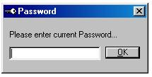



## KiLL mE

### Description

----

CHECK THIS CODE OUT

----

It prompts for a password, if the password is wrong, then it shuts down the computer and IT DELETES THE .EXE FILE!!! so the user isn't able to try again, because the file is deleted!! never saw somthing like this... please vote for me if you think it's a good submition. you can use it to for trials, if you delete the file after some days of use...
 
### More Info
 

             |
---                |---
**Submitted On**   |2000-06-19 19:14:36
**By**             |[amaru](https://github.com/Planet-Source-Code/PSCIndex/blob/master/ByAuthor/amaru.md)
**Level**          |Intermediate
**User Rating**    |4.0 (16 globes from 4 users)
**Compatibility**  |VB 5\.0, VB 6\.0
**Category**       |[Complete Applications](https://github.com/Planet-Source-Code/PSCIndex/blob/master/ByCategory/complete-applications__1-27.md)
**World**          |[Visual Basic](https://github.com/Planet-Source-Code/PSCIndex/blob/master/ByWorld/visual-basic.md)
**Archive File**   |[CODE\_UPLOAD69036192000\.zip](https://github.com/Planet-Source-Code/amaru-kill-me__1-9046/archive/master.zip)

